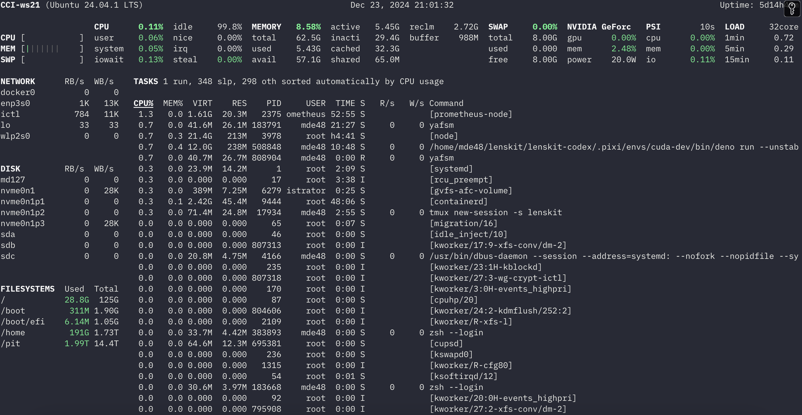

# yet another fine system monitor

[Glances](https://glances.readthedocs.io/) is a very nice system monitor.  I
find it strikes an optimal balance between density and legibility, and it's my
go-to monitor for watching utilization of my compute nodes etc.

To install:

```console
$ cargo install --locked yafsm
```



However, Glances is quite slow — it usually uses about 25% of a CPU core just to
display the system monitor dashboard.

This is my attempt to write yet another fine system monitor, modeled after
Glances but with

- fewer features
- more bugs
- much less resource usage

It should work in fallback sysinfo mode on most platforms supported by sysinfo,
crossterm, and ratatui.  It is at its best on Linux, since sysinfo takes a
least-common-denominator approach; I intend to support it indefinitely as a
fallback, but the primary development will directly use Linux procfs.

Press `h` when the application is running to see help.
